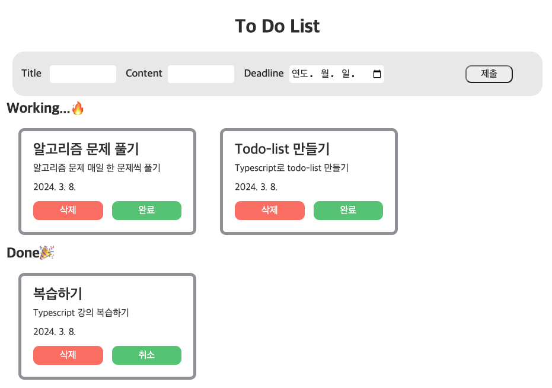

# 📝 To-do list 만들기 with TS

 

<h1>💻 STACKS</h1>

    

 

## **페이지와 기능**

#### 1. Title,Content 그리고 Deadline을 입력하고 제출 버튼을 누르면 To-do가 추가된다.

#### 2. 완료되면 `완료` 버튼을 누르면 아래로 내려가고, `취소`을 누르면 다시 위로 올라온다.

#### 3. `삭제`를 누르면 해당 To-Do가 삭제된다.

 

## **어려웠던 점 🧐**

- Typescript를 처음 사용하여, 해당 type을 지정해주는 부분부터 쉽지 않게 느껴졌다.
- 비록 RTK로 상태 관리를 하지는 못하였지만, `prop-drilling`을 통해 원하는 값을 전달해주었고, `custom hook`을 사용하여 원하는 함수를 만들어 적재적소에 사용할 수 있었다.
